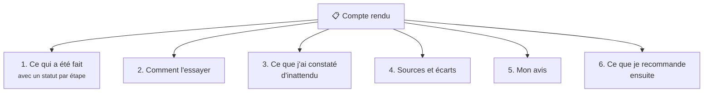

# En coulisses : le compte rendu

!!! info "Ce qui vous concerne"
    Le compte rendu est un document **interne à l'équipe** : le Developer l'écrit pour le Tech
    Leader, qui le lit d'un œil critique et vous en présente l'essentiel. Vous n'avez pas à le lire.
    Il est pourtant utile de savoir le déchiffrer, si vous voulez vérifier par vous-même ou si
    quelque chose vous semble douteux. Il suffit de demander au Tech Leader de vous le montrer.

À la fin de chaque tâche, le Developer rédige un **compte rendu** à l'intention du Tech Leader.

Pour suivre le Developer en direct, voir la carte des agents dans
[Reprendre la main](../travailler/session.md#reprendre-la-main).

## Les six sections obligatoires

### 1. Ce qui a été fait, avec un statut

Chaque étape reçoit l'un de ces quatre statuts :

| Statut | Signification | Comment le lire |
|---|---|---|
| **FAIT ET VÉRIFIÉ** | Exécuté, effet constaté | Doit être accompagné d'une **preuve** : sortie de commande, fichier produit. Sans preuve, il faut le contester. |
| **FAIT NON VÉRIFIABLE** | Exécuté, mais l'effet ne peut pas être prouvé | Le rapport doit expliquer pourquoi. C'est un point à surveiller. |
| **NON FAIT** | Pas exécuté | Souvent parce qu'une **question** attendait une réponse. Ce n'est pas un échec, c'est le comportement attendu. |
| **ÉCHOUÉ** | Tenté, sans succès | Le message d'erreur est **cité mot pour mot**. |

### 2. Comment l'essayer

Où se trouve le résultat et quelle commande lancer pour le voir fonctionner. **Essayez-le
vous-même** : c'est la meilleure façon de vous approprier le travail.

### 3. Ce que j'ai constaté d'inattendu

Tout ce qui a surpris le Developer, même hors sujet : une version différente de celle prévue, un
fichier qui existait déjà…

### 4. Sources et écarts

- Les **sources** : les liens vers la documentation consultée, avec la version de l'outil.
- Les **écarts** : les différences entre la consigne et la documentation de référence du projet, ou
  entre la consigne et la documentation de l'outil. Pour chacun : ce que dit la consigne, ce que dit
  la documentation, l'impact. Sinon, la mention « aucun écart constaté ».

### 5. Mon avis

L'**avis sincère** du Developer, critique compris. La consigne était-elle bonne ? Le résultat est-il
solide ou fragile ? Qu'aurait-il fait autrement ? De quoi n'est-il pas sûr ? Il a pour consigne de ne
**jamais** dire que tout va bien s'il a un doute.

### 6. Ce que je recommande ensuite

Une ou deux phrases : la suite logique, ou le point à trancher.

## Les signaux d'alerte

Le Tech Leader a pour consigne de **se méfier** des comptes rendus et de faire reprendre le travail
en cas de :

- « FAIT ET VÉRIFIÉ » **sans preuve** citée ;
- « tout passe » **sans la sortie réelle** des tests ;
- un écart **minimisé** ;
- une couverture de tests **floue**.

Si vous en repérez un qui lui a échappé, dites-le-lui.

!!! quote "Rappel du Developer"
    « Un travail à moitié fait et honnêtement signalé vaut mieux qu'un travail bâclé présenté comme
    terminé. »

??? abstract "Sources"
    - Format du compte rendu : `C-Users-votre-nom-.claude/agents/developer.md`
    - Carte des agents dans VS Code :
      [code.claude.com/docs/en/vs-code](https://code.claude.com/docs/en/vs-code)
