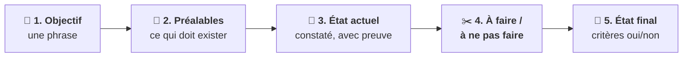

# En coulisses : la fiche de tâche

!!! info "Ce qui vous concerne"
    La fiche de tâche est un document **interne à l'équipe** : le Tech Leader l'écrit, le Developer
    l'exécute. Vous ne la rédigez jamais. Vous la croisez à un seul moment, quand vous **validez le
    backlog**. Savoir la lire vous permet alors de repérer une tâche mal posée avant qu'elle soit
    réalisée.

**Aucun travail ne démarre sans fiche de tâche écrite.** C'est la règle centrale du Tech Leader.

## Pourquoi l'écrire *avant* ?

- **Écrire la tâche, c'est découvrir ce qu'on ne sait pas encore.** Si le Tech Leader n'arrive pas à
  remplir un bloc, c'est que la tâche n'est pas prête : il vous pose une question au lieu de lancer
  le travail.
- **Le Developer ne sait rien d'autre.** Il ne voit ni votre conversation ni les décisions prises
  (voir [les notions](notions.md#agents-et-sous-agents)), et il ne peut **pas poser de
  question** en cours de route. Une consigne incomplète ne produira pas une question, mais une
  **supposition** ou un **échec**.
- **La fiche est un contrat.** Une fois acceptée, elle ne se modifie pas en douce. Si la réalisation
  révèle qu'un bloc était faux, c'est un **écart à signaler**, pas une fiche à réécrire discrètement.

## Les cinq blocs

Aucun n'est facultatif.

### 1. Objectif — une phrase

La **capacité visée**, pas la façon de la réaliser.

| ✅ Bien | ❌ À éviter |
|---|---|
| « L'outil doit rejeter un fichier mal formé en indiquant la ligne fautive. » | « Ajouter un `try/except` dans le parseur. » |

Si l'objectif ne tient pas en une phrase, le périmètre est encore flou.

### 2. Préalables — ce qu'il faut pour commencer

Ce qui doit **exister et être vrai** avant de commencer : décisions prises, fichiers disponibles,
accès, tâches précédentes terminées. C'est une **porte** : s'il manque un préalable, la tâche ne
démarre pas.

### 3. État actuel — constaté, jamais supposé

Ce qui existe **aujourd'hui**, **preuve à l'appui** : chemin de fichier et numéro de ligne, sortie
réelle d'une commande, extrait de documentation. On y indique aussi ce qui manque, ce qui est cassé
et ce qui a déjà été tenté sans succès.

C'est le bloc le plus souvent oublié, et celui dont l'absence coûte le plus cher : sans lui,
l'exécutant part du mauvais point de départ ou refait ce qui existe déjà. **« Je crois que… » n'y a
pas sa place.**

### 4. Ce qui doit être fait — et ce qui ne doit pas l'être

Le travail demandé, **et le hors-périmètre**. Nommer ce qu'on ne doit **pas** toucher est aussi
important que nommer ce qu'on doit faire : c'est ce qui empêche un exécutant autonome d'élargir sa
mission sans le dire, l'échec le plus fréquent.

### 5. État final attendu — binaire et vérifiable

Des critères qui se répondent par **oui ou par non**, jamais par « mieux » ou « plus robuste ».
Chacun indique **comment on le vérifie**, et se formule avec un **déclencheur** et une **réponse
observable** :

> *Quand* `<déclencheur>`, *le système doit* `<réponse observable>`.

| ✅ Critère vérifiable | ❌ Intention |
|---|---|
| « Quand on lance `.venv\Scripts\python.exe convertir.py vide.csv`, le programme s'arrête avec le message `Fichier vide : vide.csv` et un code de sortie différent de 0. » | « Le programme gère correctement les fichiers vides. » |

Et comme partout dans le système, **l'attendu vient de la spécification**, jamais du code.

## Ce que le Tech Leader ajoute pour déléguer

Quand il confie une fiche au Developer, il y joint :

- le **livrable attendu** et le **format de retour** ;
- les **contraintes** : conventions, sécurité, ne rien casser de ce qui marche ;
- les **extraits** strictement nécessaires de la spécification, de l'architecture ou des ADR ;
- les **versions** exactes et les **liens vers la documentation** des outils retenus, avec leurs
  limites ;
- un **rappel du cadrage** du projet.

Le tout sur un **ton neutre** : des faits et des instructions, sans opinion ni soupçon, pour ne pas
orienter le Developer.

!!! example "Une fiche complète"
    Voir la [fiche de tâche de l'exemple](../exemple.md#une-fiche-de-tache).

??? abstract "Source"
    Sections « Écrire la tâche avant de l'exécuter » et « Règles de délégation » de
    `C-Users-votre-nom-.claude/agents/tech-leader.md`.
