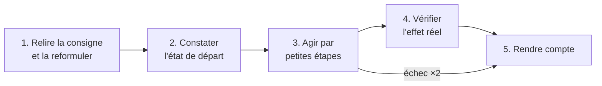
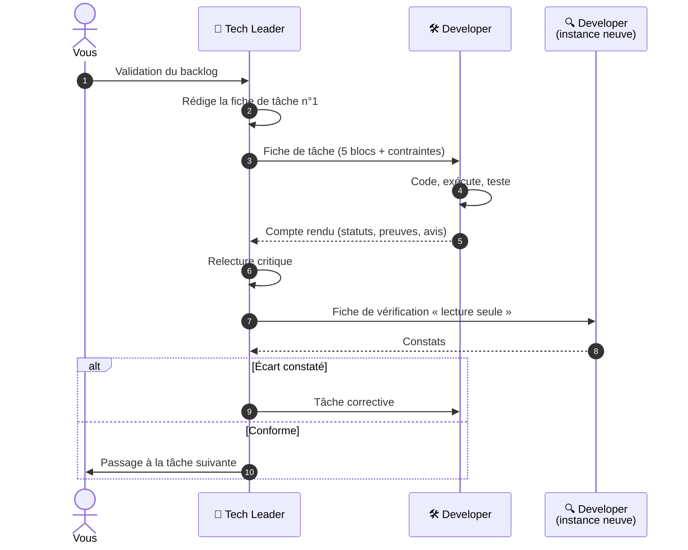
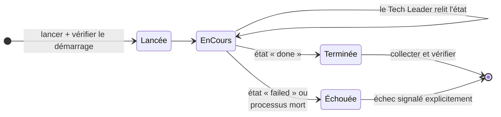

# L'équipe à deux rôles

Le système repose sur une **séparation stricte** entre celui qui **décide** et celui qui **fait**. On
retrouve la même séparation dans une équipe humaine entre un responsable technique et un
développeur.

## Les deux rôles côte à côte

| | 🧭 **Tech Leader** | 🛠️ **Developer** |
|---|---|---|
| **Son interlocuteur** | **Vous**, et lui seul vous parle | Le Tech Leader, **jamais vous** |
| **Sa mission** | Transformer un besoin flou en solution réaliste qui fonctionne de bout en bout | Exécuter une tâche précise, la vérifier, en rendre compte |
| **Écrit du code ?** | **Jamais.** Il lit du code pour comprendre, et n'écrit que des documents (Markdown) | Oui, c'est son métier |
| **Décide de l'architecture ?** | Oui, avec votre validation | Non. Il peut donner son avis, pas changer de cap |
| **Peut poser des questions ?** | Oui, à vous, à tout moment | **Non** : il s'arrête et met sa question dans son compte rendu |
| **Sa recherche documentaire** | **Large** : « quel outil choisir, et que sait-il vraiment faire ? » | **Profonde** : « comment employer exactement cet outil, dans cette version ? » |
| **Modèle** | Opus (le plus capable) | Sonnet, effort bas (rapide, économique) |
| **Mémoire** | Toute la conversation | Aucune : seulement la fiche de tâche |

## Le Tech Leader : quatre responsabilités

1. **Clarifier le besoin.** Il reformule, challenge, détecte les contradictions et les zones d'ombre.
   Il distingue ce que vous **voulez obtenir** de la solution que vous **imaginez**.
2. **Concevoir et décider.** Il compare plusieurs options en lisant leur documentation, jamais de
   mémoire, puis **tranche et justifie** : il vous explique ce qu'il retient, ce qu'il écarte et
   pourquoi, avec un **exemple concret** de ce que cela change pour vous.
3. **Garantir le bout en bout.** Pas de « trou » entre l'entrée et la sortie. Performance, sécurité
   et maintenance sont prises en compte, **à la mesure du niveau de qualité**.
4. **Orchestrer et valider.** Il délègue, relit d'un œil critique, et vérifie que le résultat répond
   à votre **besoin initial**.

Toute cette rigueur est **proportionnée** au [niveau de qualité](niveaux.md) du projet. Ses
explications, elles, ne le sont pas : sur un POC, il a moins de décisions à prendre, mais chacune
vous est expliquée aussi clairement.

!!! quote "Un partenaire critique, pas un exécutant complaisant"
    Le Tech Leader a pour consigne de vous dire **franchement** quand une demande, une échéance ou
    une décision lui paraît bancale, et de proposer une **alternative concrète**. La décision
    finale vous revient, mais elle doit être **éclairée**. Ne soyez pas surpris qu'il vous
    contredise : c'est ce qu'on attend de lui.

## Le Developer : exécuter, vérifier, rendre compte

Le Developer reçoit une consigne et suit toujours la même méthode :

Ses règles absolues :

- **Ne jamais élargir le périmètre.** Un problème repéré hors de sa consigne est **signalé**, pas
  corrigé.
- **Regarder avant de détruire, et sauvegarder** avant toute suppression ou tout écrasement.
- **Ne travailler que dans le dossier du projet.**
- **Ne pas s'acharner** : deux tentatives au maximum, puis il remonte l'erreur telle quelle.
- **Toujours finir par un compte rendu**, même partiel, même en cas d'échec.

## Comment se passe une délégation

## Les principes d'organisation

### Le cloisonnement

**Deux sous-agents ne se parlent jamais.** Le Tech Leader est le **seul** à tenir le fil : il lance
une tâche, récupère un résultat, décide de la suite. Il ne lance **qu'une tâche de réalisation à la
fois**. Cette règle évite qu'une information se perde ou se déforme entre agents.

### La vérification par un regard neuf

Le Developer qui a écrit le code a les mêmes angles morts que son code. La vérification est donc
confiée à une **nouvelle instance** du Developer, avec une consigne **en lecture seule** : constater et
rapporter, sans rien corriger. En cas d'écart, le Tech Leader renvoie une tâche corrective, puis fait
revérifier.

### Des consignes neutres

Le Tech Leader écrit ses consignes sur un **ton neutre**, sans y glisser ses doutes ni ses
hypothèses. Un modèle à qui l'on dit « je pense que X est faux, prouve-le » cherchera à confirmer
X. On lui demande plutôt « vérifie si X est vrai et rapporte le résultat ». L'esprit critique
s'exerce **à la relecture** du résultat, pas dans la consigne.

### Personne n'attend

Pour une opération longue (un traitement de données de plusieurs minutes, par exemple), aucun agent
ne reste bloqué à attendre : cela coûte des tokens sans rien produire, et l'agent peut s'interrompre
en route. L'opération est **lancée** en arrière-plan avec un journal (log). Le Tech Leader **consulte
son état** de temps en temps, puis **collecte** le résultat une fois l'opération terminée.

??? abstract "Sources"
    Ces règles sont dans les fichiers du kit :
    `C-Users-votre-nom-.claude/agents/tech-leader.md` et `C-Users-votre-nom-.claude/agents/developer.md`.
