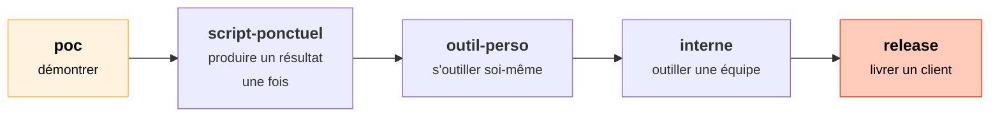
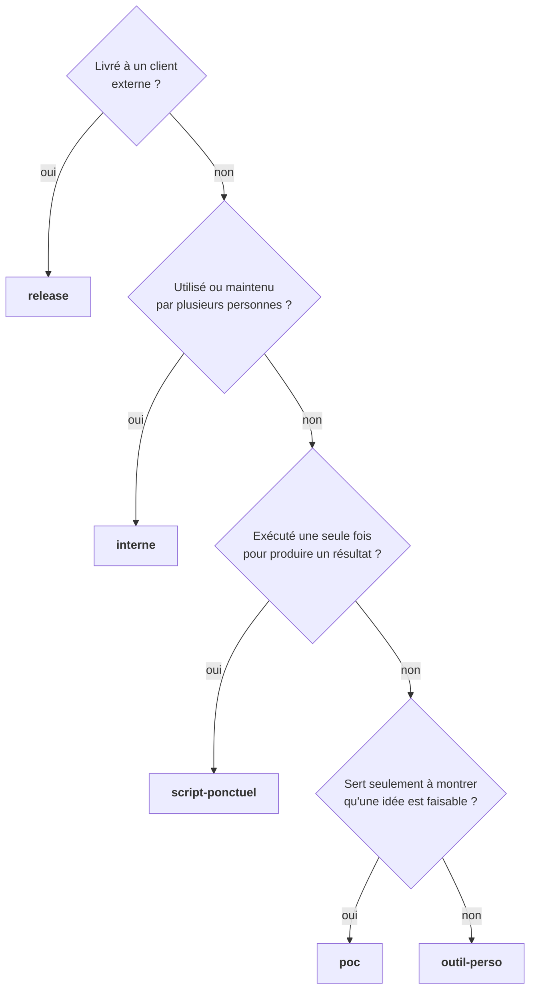

# Les niveaux de qualité

Une démo à montrer vendredi et une application livrée à un client ne méritent pas la même
rigueur. Le **niveau de qualité**, déclaré dans le document projet, dit aux agents **jusqu'où
aller**. C'est la première des [règles d'ingénierie](regles-ingenierie.md).

De gauche à droite, le formalisme, les tests et la robustesse augmentent, mais aussi le temps passé.

## Choisir son niveau

En cas d'hésitation entre deux niveaux, prenez le plus bas : il est plus facile de monter d'un niveau
que de rattraper du temps perdu en formalisme.

## Ce que chaque niveau change

| | `poc` | `script-ponctuel` | `outil-perso` | `interne` | `release` |
|---|---|---|---|---|---|
| **Portes de validation** | 1 | 1 | 2 | 3 | 3, revue finale détaillée |
| **Documents** | Un README pour lancer la démo | Spec courte, rapport de contrôle | Spec, décisions clés, backlog | Spec, architecture, ADR des choix structurants, backlog | Tout, plus une documentation utilisateur |
| **Choix des outils** | Le premier outil mature qui convient | Idem | Deux candidats comparés | Comparatif | Comparatif complet : maturité, licence, support |
| **Tests** | Le scénario de la démo | Cas représentatifs et contrôle du résultat (comptages, totaux) | Cas normaux et erreurs de saisie prévisibles | Tous les critères et les cas limites | Idem, plus la non-régression |
| **Erreurs** | Arrêt avec un message clair | Arrêt clair, aucune donnée perdue | Messages compréhensibles | Idem, plus un journal | Messages pour le client, journal, reprise |
| **Performance, déploiement, maintenance** | Hors sujet | Tenir le volume réel | Le strict utile | Pris en compte | Exigés et vérifiés |

!!! example "Le cas du script ponctuel"
    Une migration de données ne s'exécute qu'une fois, mais **son résultat doit être juste**. Le code
    peut être sommaire. En revanche, le contrôle du résultat (« 12 482 lignes en entrée, 12 482 en
    sortie, totaux identiques ») est indispensable.

## Ce qui ne change jamais

Le niveau règle **la quantité** de travail, jamais **l'honnêteté** :

- pas de secret en clair, pas de vraie donnée dans les tests ;
- aucun repli silencieux : une donnée manquante provoque une erreur ;
- le résultat attendu vient de l'écrit, même si l'écrit tient en trois lignes ;
- la documentation des outils est lue avant de les utiliser ;
- les comptes rendus restent honnêtes : un POC non testé se dit non testé.

## « Hors niveau » : noter sans traiter

Un agent consciencieux voit forcément des améliorations possibles. Le système lui demande de les
**noter en une ligne** au lieu d'en faire une question, une tâche ou une validation de plus :

> **Hors niveau** — Les montants au format anglais (`1,234.56`) ne sont pas gérés. Sans objet pour
> un `poc` limité aux exports de la banque.

Vous gardez l'information. Si le projet monte en niveau, la liste des points « hors niveau » devient
une bonne base de travail.

## Changer de niveau

Un POC convaincant devient souvent un outil interne. C'est un **recadrage explicite** : modifiez le
niveau dans le document projet, redémarrez VS Code, puis prévenez le Tech Leader. Le code écrit au niveau inférieur n'est
**pas** réputé conforme au nouveau niveau. Le Tech Leader doit le réévaluer et vous dire ce qu'il
faut reprendre.

??? abstract "Source"
    Section 1 de `mon-projet-claude-code/.claude/regles-ingenierie.md`, et section « Proportionner au
    niveau de qualité » de `C-Users-votre-nom-.claude/agents/tech-leader.md`.
