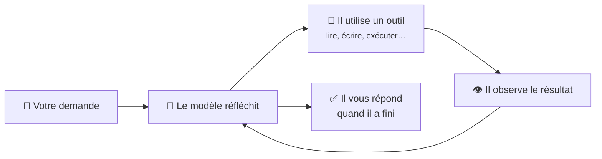
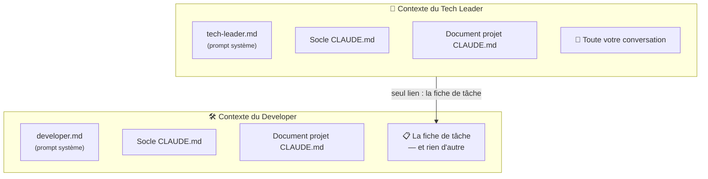
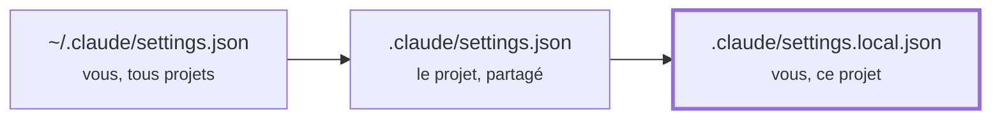

# Les notions de base

Cette page pose le vocabulaire nécessaire pour comprendre le reste du guide. Chaque terme est
également repris dans le [glossaire](../glossaire.md).

## Claude Code, un assistant qui agit

Un assistant conversationnel classique **répond** : vous lui demandez un script, il vous l'affiche,
vous le copiez. **Claude Code agit** : il lit les fichiers de votre dossier, en crée, les modifie, lance
des commandes, cherche sur le web et lit le résultat de ce qu'il a fait pour décider de la suite.

Vous l'utilisez dans **VS Code**, au travers du panneau de conversation de l'extension Claude Code.

Ce fonctionnement s'appelle une **boucle agentique** :

## Le modèle

Le **modèle** est le « cerveau » : le réseau de neurones qui lit et produit du texte. Anthropic en
propose plusieurs familles. Le kit en utilise deux :

| Modèle | Caractère | Utilisé par |
|---|---|---|
| **Opus** | Le plus capable, plus lent et plus coûteux | La session principale, donc le **Tech Leader** (réglage `"model": "opus"`) |
| **Sonnet** | Rapide et économique, très bon exécutant | Le **Developer** (`model: sonnet` dans son rôle) |

Le choix est délibéré : **réfléchir juste** (cadrer, décider, vérifier) mérite le modèle le plus
capable. **Exécuter une consigne précise** n'en a pas besoin.

## L'effort

L'**effort** règle la quantité de réflexion que le modèle s'accorde avant de répondre : `low`,
`medium`, `high`, `xhigh`. Plus il est élevé, plus la réponse est approfondie, mais plus elle est
lente et coûteuse. Le kit règle la session sur `medium` et le Developer sur `low`.

Dans l'extension, cliquez sur le **nom du modèle**, en bas de la zone de saisie, pour changer de
modèle ou d'effort. **Attention** : un niveau d'effort choisi ainsi (sauf `max`) devient **votre
réglage par défaut** pour ce modèle, et remplace celui du kit.

## Les tokens

Le modèle ne lit pas des mots mais des **tokens**, des morceaux de mots (environ ¾ de mot en
moyenne). Tout se compte en tokens : ce que le modèle lit, ce qu'il écrit, **et donc ce que vous
consommez** sur votre abonnement.

## Le contexte

Le **contexte** (ou fenêtre de contexte) est tout ce que le modèle a « sous les yeux » à un instant :
ses instructions, la conversation, les fichiers qu'il a lus, les résultats de ses commandes. **Il n'a
aucune autre mémoire.** Ce qui n'est pas dans le contexte n'existe pas pour lui.

Le contexte a une taille limitée. Quand il se remplit, Claude Code le **compacte** : il résume la
conversation pour faire de la place. Les instructions données **seulement à l'oral** dans la
conversation peuvent alors se perdre. Les fichiers `CLAUDE.md`, eux, sont relus.

!!! tip "Conséquence pratique"
    Une consigne importante et durable s'écrit dans le **document projet**, pas seulement dans le
    chat. Le kit fournit deux commandes pour
    [encadrer un compactage](../travailler/session.md#avant-et-apres-un-compactage).

## Le prompt système et les fichiers `CLAUDE.md`

Le **prompt système** est le texte d'instructions que le modèle reçoit **avant** toute conversation.
Il définit qui il est et comment il se comporte. Le rôle du Tech Leader (`tech-leader.md`)
**remplace** le prompt système par défaut de Claude Code.

Les fichiers **`CLAUDE.md`** sont des instructions complémentaires, écrites par vous et chargées
automatiquement au début de chaque session. Le kit en utilise deux :

- le **socle** (`C:\Users\<votre-nom>\.claude\CLAUDE.md`), qui s'applique partout ;
- le **document projet** (`CLAUDE.md` à la racine du projet), propre à un projet. Sa première ligne
  charge les [règles d'ingénierie](regles-ingenierie.md), communes à tous les projets du kit.

!!! warning "Une instruction n'est pas un verrou"
    Le modèle **lit et suit** les `CLAUDE.md`, mais rien ne le **force** mécaniquement à les
    respecter. C'est pourquoi les règles doivent être claires, courtes et non contradictoires. Et
    c'est pourquoi **votre vigilance** reste nécessaire.

## Agents et sous-agents

Un **agent** est une instance du modèle dotée d'un rôle (son prompt système), d'une liste d'outils et
d'un modèle. La **session principale** est l'agent avec lequel vous discutez : ici, le **Tech
Leader**.

Un **sous-agent** est un agent que la session principale **lance** pour lui confier une tâche. Il
démarre avec un **contexte vierge** : il ne voit pas votre conversation. Il travaille seul, puis
renvoie **un unique message final** à celui qui l'a lancé. **Il ne peut pas vous poser de
question** : Claude Code lui retire cet outil.

Qui charge quoi :

Le Developer **ne connaît ni votre conversation ni le rôle du Tech Leader**. Tout ce qu'il doit
savoir doit donc figurer dans la **fiche de tâche**. C'est ce qui rend ce document si important
(voir [En coulisses : la fiche de tâche](coulisses-fiche-de-tache.md)).

## Les outils

Un agent agit à travers des **outils**. Les principaux :

| Outil | Ce qu'il fait |
|---|---|
| `Read`, `Glob`, `Grep` | Lire un fichier, trouver des fichiers, chercher du texte |
| `Write`, `Edit` | Créer un fichier, en modifier une partie |
| `Bash`, `PowerShell` | Exécuter une commande système |
| `WebSearch`, `WebFetch` | Chercher sur le web, lire une page |
| `Agent` | Lancer un sous-agent |
| `AskUserQuestion` | Vous poser une question à choix (réservé à la session principale) |

## Les permissions

Avant une action sensible (modifier un fichier, exécuter une commande), Claude Code peut **vous
demander l'autorisation**. Le **mode de permission** règle ce qui passe sans demander :

| Mode (libellé dans l'extension) | Ce qui passe sans vous demander | Pour quel usage |
|---|---|---|
| **Manual** | Les lectures uniquement | Tout contrôler vous-même, travail sensible |
| **Edit automatically** | Lectures, modifications de fichiers, commandes de fichiers courantes | Itérer sur du code que vous relisez |
| **Plan** | Lectures : Claude décrit ce qu'il va faire et attend votre accord | Analyser sans rien toucher |
| **Auto** | Tout, avec des vérifications de sécurité en arrière-plan | Tâches longues |

On change de mode en cliquant sur l'**indicateur de mode**, en bas de la zone de saisie.

!!! tip "Pour débuter"
    Avec les versions récentes, l'extension démarre en **Auto**. Pour vos premières missions,
    passez en **Manual** ou en **Edit automatically** : vous verrez passer chaque action et
    apprendrez comment les agents travaillent.

## Les réglages (`settings.json`)

Les fichiers **`settings.json`** contiennent les réglages techniques de Claude Code (modèle, effort,
rôle actif, permissions…). Ils existent à plusieurs niveaux. Quand une même clé est définie à deux
endroits, **le plus spécifique l'emporte** :

Dans le kit : le niveau personnel fixe `model` et `effortLevel`, et le niveau projet fixe
`agent: tech-leader`.

??? abstract "Sources"
    - Modèles et alias : [model-config](https://code.claude.com/docs/en/model-config)
    - Sélecteur de modèle et d'effort, indicateur de mode, mode de départ :
      [vs-code](https://code.claude.com/docs/en/vs-code)
    - `CLAUDE.md`, compaction, « contexte, pas configuration imposée » :
      [memory](https://code.claude.com/docs/en/memory)
    - Sous-agents, `AskUserQuestion` retiré, chargement des `CLAUDE.md` :
      [sub-agents](https://code.claude.com/docs/en/sub-agents)
    - Modes de permission :
      [permission-modes](https://code.claude.com/docs/en/permission-modes)
    - Priorité des réglages : [settings](https://code.claude.com/docs/en/settings)
