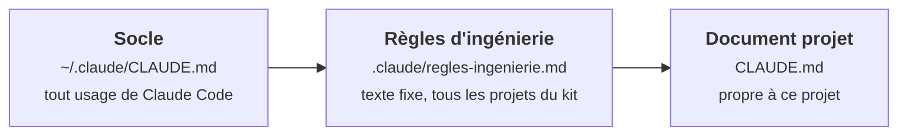
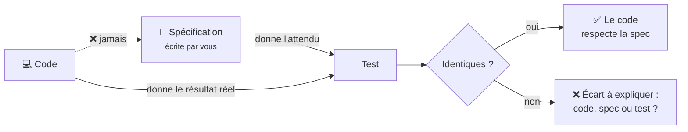

# Les règles d'ingénierie

Les **règles d'ingénierie** complètent le [socle](socle.md) pour le développement. Elles vivent dans
le fichier `.claude\regles-ingenierie.md` de chaque projet, copié avec le modèle. La première ligne
du `CLAUDE.md` du projet le charge :

```text
@.claude/regles-ingenierie.md
```

C'est un **texte fixe**, identique dans tous les projets du kit. Ne le modifiez pas pour un projet :
ce qui est propre au projet va dans les rubriques du `CLAUDE.md`.



## 1. Niveau de qualité

**Ce qu'elle dit.** Chaque projet déclare un **niveau de qualité** (`poc`, `script-ponctuel`,
`outil-perso`, `interne` ou `release`), qui règle la **profondeur** du travail : nombre de portes,
documents, tests, robustesse. Jamais son **honnêteté**.

Le détail est sur la page [Les niveaux de qualité](niveaux.md).

## 2. Documentation des outils : la version en place

**Ce qu'elle dit.** Avant d'utiliser une bibliothèque, l'agent vérifie la **version réellement
installée** dans le projet et lit la documentation de **cette** version.

**Pourquoi.** C'est l'application au code de la [règle 1 du socle](socle.md#1-verifier-ou-dire-quon-repond-de-memoire) :
entre deux versions, une fonction change de nom, une option disparaît.

## 3. Erreurs dans le code : jamais avalées

**Ce qu'elle dit.** Le code ne doit jamais masquer une erreur ni remplacer une donnée absente par une
valeur par défaut. Une donnée manquante provoque une **erreur claire**.

**Pourquoi.** C'est l'application au code de la
[règle 2 du socle](socle.md#2-jamais-de-valeur-par-defaut-ni-de-repli-silencieux).

## 4. Python : toujours le venv du projet

**Ce qu'elle dit.** Tout code Python s'exécute avec l'**environnement virtuel** du projet (le venv),
appelé par son chemin : `.venv\Scripts\python.exe`. S'il n'y a pas de venv, l'agent **demande**
avant d'en créer un.

**Pourquoi.** Un venv isole les bibliothèques de chaque projet : installer une version pour le projet
A ne casse pas le projet B. Le chemin complet est indispensable, car chaque commande de l'agent
s'exécute dans un terminal neuf, où une « activation » précédente est perdue.

**Ce que vous verrez.** Des commandes du type `.venv/Scripts/python.exe mon_script.py`, et une
demande d'autorisation avant toute installation.

## 5. Tests : pas de test unitaire, l'attendu vient de l'écrit

C'est la règle la plus originale du système.

**Quelques définitions.** Un **test** est un petit programme qui vérifie automatiquement qu'un autre
programme fait ce qu'il doit. Un **test unitaire** vérifie une fonction isolée, à l'intérieur du code.
Un **test fonctionnel** vérifie une capacité **visible de l'extérieur** : « quand je donne ce fichier
en entrée, j'obtiens ce résultat ». Un **test de bout en bout** traverse toute la chaîne.

**Ce qu'elle dit.**

- **Pas de test unitaire.** Seuls les tests fonctionnels et de bout en bout sont admis.
- **Le résultat attendu se lit dans l'écrit** : la spécification ou la documentation de référence du
  projet. **Jamais** dans le code, **jamais** en lançant le programme pour « voir ce qu'il sort ».
- Si l'écrit ne dit rien sur un cas, l'agent **vous demande** quel est le résultat attendu.
- Toujours sur des **données fabriquées** pour le test, jamais sur de vraies données.
- **Un test qui échoue ne se modifie pas pour passer.** L'agent doit dire si c'est le code qui est
  faux, la spécification, ou la traduction de la spécification en test, preuve à l'appui.

**Pourquoi.** Un test écrit en regardant le code ne peut que **confirmer le code**, bugs compris :
c'est comme corriger une copie avec les réponses de l'élève. Le test n'a de valeur que si l'attendu
vient d'une source **indépendante** du code : ce que **vous** avez écrit que le système devait faire.



**Ce que vous verrez.** Des questions du type « la spécification ne dit pas ce qui doit se passer si
le fichier est vide : que voulez-vous ? ». Ce sont des questions **de fond** : vos réponses
enrichissent la spécification.

## 6. Sécurité du code

**Ce qu'elle dit.** Aucune faille de sécurité introduite dans le code (référence : le Top 10 OWASP).
Les secrets vivent dans `.env`, qui n'est jamais versionné.

??? abstract "Source"
    Le texte intégral est dans `mon-projet-claude-code/.claude/regles-ingenierie.md`.
