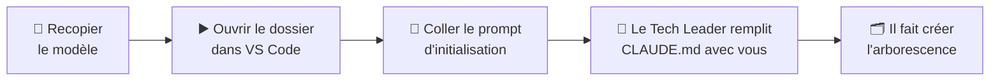

# 3. Initialiser un projet

Un **projet** est un dossier dans lequel vous travaillez avec Claude Code. Vous copiez le modèle,
puis c'est le **Tech Leader** qui initialise le projet avec vous, lors de la première conversation.



## Étape 1 — Recopier le modèle

Copiez le **contenu** de `mon-projet-claude-code\` dans le dossier de votre projet, sans oublier
`.env` et `.claude\`. Vous obtenez :

```text
mon-outil/
├── CLAUDE.md               ← le document projet, encore vierge
├── .env                    ← les secrets (vide au départ)
└── .claude/
    ├── settings.json       ← { "agent": "tech-leader" }
    └── regles-ingenierie.md ← texte fixe, chargé par CLAUDE.md
```

Le fichier `regles-ingenierie.md` contient les [règles d'ingénierie](../comprendre/regles-ingenierie.md)
communes à tous les projets du kit. **Ne le modifiez pas** : la première ligne du `CLAUDE.md` le
charge automatiquement.

La ligne `"agent": "tech-leader"` **active le Tech Leader** : dans ce dossier, la session principale
adopte ce rôle.

!!! tip "Projet déjà commencé sans le kit"
    Suivez plutôt [Reprendre un projet existant](reprendre-un-projet-existant.md) : mise en place
    sans rien écraser, puis audit par le Tech Leader.

## Étape 2 — Ouvrir le projet dans VS Code

Dans VS Code, faites **Fichier → Ouvrir le dossier** et choisissez **la racine du projet**, celle
qui contient `.claude\`. Ouvrez ensuite Claude Code (icône ✱) et démarrez une conversation.

!!! warning "VS Code était déjà ouvert ?"
    Les fichiers de configuration, ceux du projet comme les globaux, ne sont pris en compte qu'après
    un **redémarrage de VS Code**. Si vous avez copié le modèle pendant que VS Code tournait,
    redémarrez-le avant d'ouvrir le dossier.

Pour vérifier que le rôle est actif, demandez :

```text
Quel est ton rôle ?
```

Il doit se présenter comme le **Tech Leader**. Si ce n'est pas le cas, voir la
[FAQ](../faq.md#mise-en-route).

## Étape 3 — Initialiser le projet avec le Tech Leader

Copiez ce prompt, remplacez la ligne entre chevrons par votre projet, puis envoyez-le :

```text
Initialise ce projet avec moi. Le CLAUDE.md est encore le modèle vierge ;
aucun code métier pour l'instant.

Mon projet en deux phrases : <ce que je veux faire, et pour qui>.
Niveau de qualité visé : <poc | script-ponctuel | outil-perso | interne | release>.

1. Remplis le CLAUDE.md rubrique par rubrique, dans l'ordre. Pour chacune :
   pose-moi tes questions, propose des valeurs quand j'hésite, montre-moi le
   texte, et ne l'écris qu'après mon accord.
2. Une fois les 5 rubriques validées, propose l'arborescence qui en découle
   (dossiers des livrables, du code et des tests, venv, .gitignore). Après
   mon accord, fais-la créer par le developer, puis vérifie-la.
3. Termine par un récapitulatif : ce qui existe, ce qui reste ouvert.
```

**Pourquoi ce prompt fonctionne :**

- **« Niveau de qualité visé »** : c'est l'information qui pèse le plus sur la suite. Une démo
  (`poc`) se prépare en quelques minutes, une livraison client (`release`) demande plus de rigueur.
  Si vous hésitez, consultez [Choisir son niveau](../comprendre/niveaux.md#choisir-son-niveau).

- **« Rubrique par rubrique, après mon accord »** : vous gardez la main sur chaque décision, sans
  être noyé sous vingt questions d'un coup.
- **« Propose des valeurs quand j'hésite »** : vous n'avez pas besoin de connaître les bonnes
  pratiques, il vous les soumet.
- **« Fais-la créer par le developer »** : le Tech Leader n'écrit que des documents. La création des
  dossiers, du venv et du `.gitignore` revient au Developer. Votre accord sur l'arborescence vaut
  autorisation de créer le venv, conformément aux [règles d'ingénierie](../comprendre/regles-ingenierie.md#4-python-toujours-le-venv-du-projet).
- **« Aucun code métier »** : la conversation s'arrête à la préparation du projet. Votre premier
  vrai besoin viendra ensuite.

### Ce que le Tech Leader va vous demander

Les cinq rubriques du document projet :

| # | Rubrique | La question | Pourquoi |
|---|---|---|---|
| 1 | **Le produit** | Que fait ce projet, pour qui ? Quel est son [**niveau de qualité**](../comprendre/niveaux.md) ? | Le niveau règle toute la finesse du travail. Sans lui, l'agent choisit à votre place, souvent trop haut. |
| 2 | **Documentation de référence** | Où est l'écrit qui fait foi : cahier des charges, format de données, règles métier ? | C'est là que se lit le **résultat attendu** des tests, jamais dans le code ([règles d'ingénierie](../comprendre/regles-ingenierie.md#5-tests-pas-de-test-unitaire-lattendu-vient-de-lecrit)). |
| 3 | **Emplacement des livrables** | Où ranger la spécification, l'architecture, les ADR et le backlog ? | Le Tech Leader n'invente aucun chemin. |
| 4 | **Conventions et contraintes** | Version de Python, venv, langue, Git ou pas, ce qui est versionné… | Ce qu'on ne peut pas deviner en lisant le dossier. |
| 5 | **Hors-périmètre** | Qu'est-ce qu'on ne touche **jamais** ici ? | C'est ce qui arrête un exécutant zélé. |

!!! tip "Préparez vos documents"
    Si vous avez déjà un cahier des charges ou la description d'un format de données, déposez-le
    dans le dossier **avant** de lancer le prompt : il servira de documentation de référence.

!!! tip "Relisez ce qu'il propose"
    Un bon document projet est **vérifiable** (« les sorties vont dans `resultats/` », pas « rangez
    bien »), **court** (moins de 200 lignes) et **tranché** : pas de « à définir ». L'[exemple
    complet](../exemple.md#le-document-projet) en montre un.

!!! warning "N'utilisez pas `/init`"
    Cette commande de Claude Code génère un `CLAUDE.md` selon son propre plan, qui ne respecte pas
    les cinq rubriques.

## Étape 4 — Ranger les secrets dans `.env`

Si votre projet utilise une clé d'API, un mot de passe ou un jeton, **c'est dans `.env` qu'il va**,
jamais dans le code, dans `CLAUDE.md` ou dans la conversation :

```text
API_METEO_CLE=votre-clé-ici
```

Votre code le lit, par exemple avec `python-dotenv`. `.env` ne doit jamais être partagé : le
`.gitignore` créé à l'étape 3 doit l'exclure. Les agents peuvent **nommer** un secret (« variable
`API_METEO_CLE` dans `.env` »), jamais en afficher la valeur. Claude Code ne lit pas `.env` de
lui-même : c'est une convention pour vos programmes.

---

Le projet est prêt. **Redémarrez VS Code**, pour que le document projet rempli soit pris en compte,
puis décrivez votre premier besoin **en langage courant** : la suite du guide explique
[à quoi vous attendre](../travailler/mission.md).

??? abstract "Sources"
    - Réglage `agent` :
      [code.claude.com/docs/en/sub-agents](https://code.claude.com/docs/en/sub-agents)
    - Taille recommandée, `/init` :
      [code.claude.com/docs/en/memory](https://code.claude.com/docs/en/memory)
