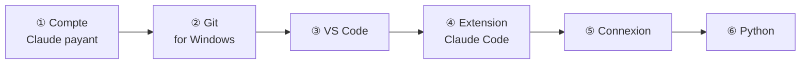

# 1. Installer Claude Code

On travaille **exclusivement** avec **Visual Studio Code** et l'**extension Claude Code**. Pas de
terminal : l'extension contient déjà Claude Code, et il n'y a rien d'autre à installer pour
l'utiliser.

## ① Avoir un compte Claude qui inclut Claude Code

Claude Code demande un abonnement **Pro, Max, Team ou Enterprise**, ou un compte **Console**
(facturation à l'usage via l'API). **Le plan gratuit de claude.ai ne donne pas accès à Claude Code.**

!!! info "Quel abonnement ?"
    Ce système fait travailler **plusieurs agents** et utilise le modèle **Opus**, le plus capable
    et le plus coûteux. Il consomme donc plus qu'une conversation simple. Si vous l'utilisez
    régulièrement, renseignez-vous auprès de la personne qui vous a transmis le kit sur l'abonnement
    adapté.

## ② Installer Git for Windows

Téléchargez et installez [Git for Windows](https://git-scm.com/downloads/win) en gardant les options
par défaut.

**Pourquoi ?** Parce que c'est essentiel pour un projet logiciel !

## ③ Installer VS Code

Installez [Visual Studio Code](https://code.visualstudio.com/), en version **1.94 ou plus**.

## ④ Installer l'extension Claude Code

Dans VS Code, ouvrez la vue **Extensions** (`Ctrl+Shift+X`), cherchez **Claude Code** (éditeur :
**Anthropic**), puis cliquez sur **Install**.

L'icône **✱** (Spark) ouvre Claude Code. Elle se trouve dans la barre d'activité, à gauche, et en haut
à droite d'un fichier ouvert.

## ⑤ Se connecter

À la première ouverture du panneau Claude Code, cliquez sur **Sign in** et terminez la connexion
dans votre navigateur.

## ⑥ Python

Le socle impose d'utiliser **l'environnement virtuel du projet** (un venv), jamais le Python
global. Il vous faut donc un Python installé sur la machine, par exemple depuis
[python.org](https://www.python.org/downloads/windows/). Les agents créeront ou utiliseront ensuite le
venv de chaque projet, **après vous avoir demandé l'autorisation**.

??? abstract "Sources"
    - Prérequis du compte : [code.claude.com/docs/en/setup](https://code.claude.com/docs/en/setup)
    - Extension, installation, connexion, CLI embarquée :
      [code.claude.com/docs/en/vs-code](https://code.claude.com/docs/en/vs-code)
