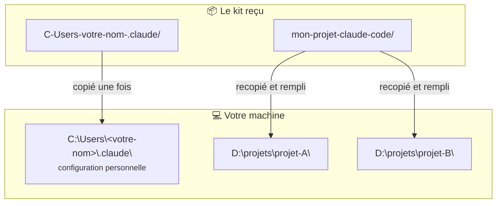

# 2. Installer le kit

Le kit comporte deux parties qui ne vont **pas au même endroit** :

| Partie du kit | Destination | Portée |
|---|---|---|
| `C-Users-votre-nom-.claude/` | `C:\Users\<votre-nom>\.claude\` | **Toutes** vos sessions Claude Code, sur tous vos projets |
| `mon-projet-claude-code/` | Recopié pour **chaque** nouveau projet | Ce projet uniquement |

Le nom `C-Users-votre-nom-.claude` est simplement le chemin `C:\Users\<votre-nom>\.claude` écrit
comme un nom de dossier : `votre-nom` représente votre nom d'utilisateur Windows.



## Étape A — La configuration personnelle

Copiez le **contenu** de `C-Users-votre-nom-.claude\` dans `%USERPROFILE%\.claude\`.

!!! warning "Ne rien écraser"
    Ce dossier existe déjà s'il a été créé par Claude Code lors de votre première connexion. Si
    `CLAUDE.md` ou `settings.json` y sont déjà présents, **fusionnez** au lieu de remplacer. Pour
    `settings.json`, ajoutez les deux clés du kit :

    ```json
    "model": "opus",
    "effortLevel": "medium"
    ```

!!! tip "Vous avez déjà une configuration Claude Code ? Faites-vous aider par Claude"
    Ouvrez le dossier `claude-team` dans VS Code, puis demandez à Claude Code de faire l'intégration
    avec vous, par exemple :

    ```text
    J'ai déjà une configuration Claude Code dans %USERPROFILE%\.claude. Aide-moi à y intégrer
    le kit du dossier C-Users-votre-nom-.claude : fusionne les settings.json, repère les agents
    ou commandes de même nom, et les consignes de mon CLAUDE.md qui contredisent ou répètent
    le socle ou les rôles du kit. Propose-moi chaque arbitrage, et ne modifie rien sans mon
    accord.
    ```

    Deux consignes contradictoires ne provoquent pas d'erreur : le modèle suit l'une ou l'autre au
    hasard. Un passage en revue avant l'installation vous évite des comportements incohérents.

### Ce que vous venez d'installer

| Fichier | Rôle |
|---|---|
| `CLAUDE.md` | Le **socle** : 5 règles de travail chargées dans **toutes** les sessions et chez **tous** les agents, quel que soit l'usage. Voir [Le socle commun](../comprendre/socle.md). |
| `settings.json` | `"model": "opus"` : les sessions utilisent le dernier modèle **Opus**. `"effortLevel": "medium"` : niveau de réflexion par défaut (valeurs possibles : `low`, `medium`, `high`, `xhigh`). |
| `agents/tech-leader.md` | Le rôle du **Tech Leader**. |
| `agents/developer.md` | Le rôle du **Developer**. Il précise lui-même `model: sonnet` et `effort: medium` : il tourne sur un modèle plus rapide et moins coûteux, quel que soit le modèle de la session. |
| `commands/avant-compactage.md`, `commands/apres-compactage.md` | Deux **commandes** à taper dans la conversation, `/avant-compactage` et `/apres-compactage`, pour ne rien perdre lors d'un compactage. Voir [Piloter une session](../travailler/session.md#avant-et-apres-un-compactage). |
| `commands/reprendre-apres-coupure.md` | La commande `/reprendre-apres-coupure`, pour relancer un travail interrompu par manque de crédit. Voir [Après une coupure de crédit](../travailler/session.md#apres-une-coupure-de-credit). |
| `hooks/jouer-son.ps1` | Un script de **son**, facultatif. Il ne fait **rien** tant que vous ne l'avez pas déclaré dans `settings.json`. Voir [Être prévenu par un son](../travailler/etre-prevenu-par-un-son.md). |
| `skills/documentation/SKILL.md` | La **charte de documentation**, un *skill* : des consignes que Claude Code charge seulement quand il en a besoin, ici quand vous demandez la documentation d'un projet. Elle impose un niveau onboarding exhaustif sans code source, des diagrammes Mermaid, la structure Introduction → Démarrage rapide → Documentation complète → FAQ → Glossaire, et un pied de page de navigation. Le Tech Leader confie cette rédaction au Developer, qui applique la charte. Adaptez-la à vos goûts : c'est un simple fichier Markdown. |

## Étape B — Vérifier

Ouvrez n'importe quel dossier dans VS Code, ouvrez Claude Code, puis demandez-lui :

```text
Quelles sont les règles de ton CLAUDE.md personnel ? Donne juste leurs titres.
```

Il doit citer les cinq règles du socle : « Vérifier plutôt que se souvenir », « Jamais de valeur
par défaut ni de repli silencieux »… S'il ne les connaît pas, le fichier n'est pas au bon
endroit.

!!! warning "Redémarrez VS Code après toute modification de configuration"
    Rôles (`agents/`), commandes (`commands/`), `settings.json` et `CLAUDE.md` ne sont pris en compte
    qu'après un **redémarrage complet de VS Code**, qu'il s'agisse des fichiers globaux
    (`%USERPROFILE%\.claude\`) ou de ceux d'un projet (`.claude\`). Ouvrir une nouvelle conversation
    ne suffit pas.

!!! note "Le Tech Leader n'apparaît pas encore"
    C'est normal. Installer les rôles les rend **disponibles**, mais le Tech Leader n'est **activé**
    que dans les projets qui le demandent, via leur `.claude/settings.json`. C'est l'objet de
    l'étape suivante. En dehors de ces projets, vous avez un Claude Code classique, qui applique
    tout de même le socle.

??? abstract "Sources"
    - Emplacements de `CLAUDE.md` :
      [code.claude.com/docs/en/memory](https://code.claude.com/docs/en/memory)
    - Emplacement des agents, champs `model` et `effort` :
      [code.claude.com/docs/en/sub-agents](https://code.claude.com/docs/en/sub-agents)
    - Réglages `model` et `effortLevel` :
      [code.claude.com/docs/en/settings-reference](https://code.claude.com/docs/en/settings-reference)
    - Alias de modèles (`opus`, `sonnet`) :
      [code.claude.com/docs/en/model-config](https://code.claude.com/docs/en/model-config)
