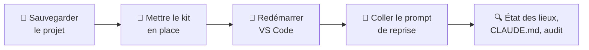

# 4. Reprendre un projet existant

Votre projet a été commencé **sans le kit** : du code existe déjà, parfois un `CLAUDE.md`, mais
aucune organisation. Le principe est le même que pour un [nouveau projet](initialiser-un-projet.md),
avec deux différences : on met le kit en place **sans rien écraser**, et le Tech Leader **audite**
le projet avant toute décision.



## Étape 1 — Sauvegarder

Avant tout, mettez le projet à l'abri :

- **sous Git** : commitez tout ce qui est en cours ;
- **sans Git** : copiez le dossier entier ailleurs.

Le Tech Leader ne modifiera rien pendant l'audit, mais vous saurez revenir en arrière si besoin.

## Étape 2 — Mettre le kit en place sans rien écraser

Avant de copier le contenu de `mon-projet-claude-code\` dans votre projet, regardez ce qui existe
déjà :

| Déjà présent dans le projet | À faire |
|---|---|
| `CLAUDE.md` | Renommez-le `CLAUDE.ancien.md`, puis copiez celui du modèle. Le Tech Leader en reprendra le contenu utile. |
| `.claude\settings.json` | Ne le remplacez pas : ajoutez-y la ligne `"agent": "tech-leader"` (voir ci-dessous). |
| `.claude\agents\tech-leader.md` ou `.claude\agents\developer.md` | Renommez-les, par exemple en `ancien-tech-leader.md`. Un rôle défini dans le projet **remplace** celui du kit qui porte le même nom. |
| `.env` | Gardez le vôtre. |

Pour `settings.json`, ajoutez la ligne juste après l'accolade ouvrante, **avec sa virgule**. Par
exemple, si le fichier contenait déjà des permissions :

```json
{
  "agent": "tech-leader",
  "permissions": { "allow": ["Bash(npm run test)"] }
}
```

Une virgule oubliée rend le fichier illisible pour Claude Code.

## Étape 3 — Redémarrer et vérifier

**Redémarrez VS Code**, ouvrez la racine du projet, puis demandez à Claude Code :

```text
Quel est ton rôle ?
```

Il doit se présenter comme le **Tech Leader**. Sinon, voir la [FAQ](../faq.md#mise-en-route).

## Étape 4 — Lancer la reprise avec le Tech Leader

Copiez ce prompt, remplacez les lignes entre chevrons, puis envoyez-le :

```text
Reprends avec moi ce projet déjà entamé, qui n'a jamais été organisé avec
toi. Le CLAUDE.md est le modèle vierge ; l'ancien, s'il existait, est dans
CLAUDE.ancien.md.

Mon projet en deux phrases : <ce qu'il fait, pour qui, où il en est>.
Niveau de qualité visé : <poc | script-ponctuel | outil-perso | interne | release>.
Ce qui me préoccupe : <ce qui marche mal, ce que je n'ose plus toucher,
ou « rien de particulier »>.

Règle pour toute cette conversation : on constate, on ne corrige rien. Aucun
fichier du projet n'est modifié, déplacé ni supprimé, à part le CLAUDE.md et
le rapport d'audit.

1. État des lieux : fais l'inventaire du projet (structure, langages,
   dépendances, venv, Git, tests, documentation, CLAUDE.ancien.md, contenu
   de .claude/). Ce qui demande une exécution (le projet s'installe-t-il,
   se lance-t-il, ses tests passent-ils ?) part à un developer en lecture
   seule. Présente-moi le résultat dans la conversation, en séparant le
   constaté du supposé ; ne l'écris dans aucun fichier.
2. Remplis le CLAUDE.md rubrique par rubrique, à partir de cet état des
   lieux : pose tes questions, propose des valeurs, montre le texte, écris
   après mon accord. Dans la rubrique 3, prévois un emplacement pour le
   rapport d'audit. Le comportement actuel du code n'est pas une référence :
   ce que le projet doit faire, c'est moi qui le dis.
3. Audit : compare le projet au niveau visé et aux règles d'ingénierie.
   Écris le rapport à l'emplacement prévu, daté, en précisant en tête qu'il
   décrit le projet à cette date et non son état actuel. Écarts classés en
   bloquant, important ou hors niveau, chacun avec sa preuve (fichier,
   ligne, sortie). Un secret en clair se localise, il ne se recopie jamais.
4. Termine par ce que tu proposes de corriger en premier, sans rien lancer.
   Si le projet n'est pas sous Git, place l'initialisation du dépôt en tête
   de ces propositions.
```

**Pourquoi ce prompt fonctionne :**

- **« On constate, on ne corrige rien »** : l'audit ne tourne pas à la refonte. Les corrections
  viendront ensuite, une par une, comme des missions ordinaires avec leurs
  [portes de validation](../travailler/mission.md).
- **« Ce qui me préoccupe »** : l'audit commence par ce qui compte pour vous.
- **« Le comportement actuel du code n'est pas une référence »** : c'est le piège principal d'une
  reprise. Décrire ce que le projet doit faire en lisant ce qu'il fait, c'est valider ses bugs. Ce
  que le projet doit faire se lit dans l'écrit, voir les
  [règles d'ingénierie](../comprendre/regles-ingenierie.md#5-tests-pas-de-test-unitaire-lattendu-vient-de-lecrit).
- **« Developer en lecture seule »** : vérifier que le projet s'installe et se lance demande des
  commandes. C'est le travail du Developer, à qui l'on interdit de corriger ce qu'il trouve.
- **État des lieux dans la conversation, jamais dans un fichier** : un état des lieux écrit sur le
  disque serait relu dans quelques semaines comme s'il décrivait encore le projet. Pour la même
  raison, le rapport d'audit est daté.
- **« Bloquant, important, hors niveau »** : vous n'obtenez pas cinquante points tous présentés
  comme urgents. Ce qui dépasse le [niveau de qualité](../comprendre/niveaux.md) est noté, pas
  traité.
- **Initialisation de Git proposée, pas lancée** : c'est vous qui décidez.

!!! tip "Projet volumineux"
    L'état des lieux, les cinq rubriques et l'audit remplissent vite une conversation : surveillez
    l'indicateur de contexte (voir [Piloter une session](../travailler/session.md)). Le `CLAUDE.md`
    validé et le rapport d'audit sont sur le disque ; l'état des lieux, lui, n'existe que dans la
    conversation. Après un [compactage](../travailler/session.md#avant-et-apres-un-compactage),
    demandez au Tech Leader de **le refaire** plutôt que de s'appuyer sur un résumé.

!!! warning "N'utilisez pas `/init`"
    Comme pour un nouveau projet, cette commande génère un `CLAUDE.md` qui ne respecte pas les cinq
    rubriques.

---

Une fois le `CLAUDE.md` validé et le rapport d'audit écrit, **redémarrez VS Code**, puis demandez la
première correction proposée, **en langage courant** : la suite du guide explique
[à quoi vous attendre](../travailler/mission.md).

??? abstract "Sources"
    - Priorité d'un rôle défini dans le projet sur le rôle global du même nom :
      [code.claude.com/docs/en/sub-agents](https://code.claude.com/docs/en/sub-agents)
