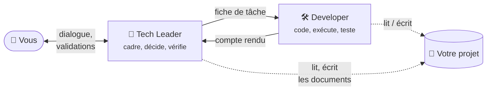

# Travailler avec l'équipe d'agents Claude Code

Bienvenue. Ce guide explique comment installer et utiliser une **organisation de travail** construite
au-dessus de **Claude Code**, l'assistant de programmation d'Anthropic, utilisé dans **VS Code** via
son extension. Il s'adresse à des personnes
proches de la technique — vous savez écrire quelques lignes de Python, lancer une commande — sans
être développeur de métier.

## En une phrase

Au lieu de parler à un assistant unique qui fait tout, vous parlez à un **chef d'équipe technique**
(le *Tech Leader*) qui clarifie votre besoin, prend les décisions avec vous, puis confie le travail
de programmation à un **développeur** (le *Developer*) et vérifie ce qu'il a produit.



## Pourquoi cette organisation ?

Un assistant de programmation laissé seul a trois défauts classiques :

1. **Il se lance trop vite.** Il comble les trous de votre demande par des suppositions, et vous
   découvrez à la fin qu'il a construit autre chose que ce que vous vouliez.
2. **Il se juge lui-même.** Celui qui a écrit le code est mal placé pour trouver ses propres erreurs.
3. **Il enjolive.** « C'est fait et ça marche » sans avoir vraiment vérifié.

Le système répond à chacun :

| Défaut | Réponse du système |
|---|---|
| Se lance trop vite | Le Tech Leader **pose des questions** tant que le besoin n'est pas clair, et **s'arrête à des portes de validation** où c'est vous qui décidez. |
| Se juge lui-même | Celui qui décide (Tech Leader) n'est pas celui qui code (Developer), et la vérification est confiée à une **instance neuve** du Developer. |
| Enjolive | Des **règles communes** imposent de citer ses sources, de prouver ce qu'on affirme et de séparer le vérifié du supposé. Chaque compte rendu utilise des **statuts explicites** (`FAIT ET VÉRIFIÉ`, `ÉCHOUÉ`…). |

!!! quote "Le principe qui traverse tout le système"
    **Mieux vaut une question qu'un résultat faux qui a l'air juste.**

    Attendez-vous à ce que les agents vous posent des questions, s'arrêtent et disent « je ne sais
    pas ». C'est voulu : c'est le signe que le système fonctionne.

## Ce que contient le kit

```text
claude-team/
├── C-Users-votre-nom-.claude/    ← à copier dans C:\Users\<votre-nom>\.claude\
│   ├── CLAUDE.md                 ← le socle : 5 règles pour tout usage
│   ├── settings.json             ← réglages globaux (modèle, niveau d'effort)
│   ├── agents/
│   │   ├── tech-leader.md        ← le rôle du chef d'équipe
│   │   └── developer.md          ← le rôle du développeur
│   └── commands/
│       ├── avant-compactage.md   ← /avant-compactage : tout sauvegarder
│       ├── apres-compactage.md   ← /apres-compactage : reprendre le fil
│       └── reprendre-apres-coupure.md ← /reprendre-apres-coupure : crédit épuisé
├── mon-projet-claude-code/       ← modèle à recopier pour chaque nouveau projet
│   ├── CLAUDE.md                 ← le « document projet » à remplir (5 rubriques)
│   ├── .env                      ← emplacement des secrets (vide)
│   └── .claude/
│       ├── settings.json         ← active le Tech Leader dans ce projet
│       └── regles-ingenierie.md  ← règles de développement, texte fixe
└── mkdocs.yml, docs/, includes/  ← les sources de cette documentation
```

## Par où commencer ?

<div class="grid cards" markdown>

- **🚀 Je découvre**

    Suivez les trois étapes de **Démarrer** dans l'ordre :
    [installer Claude Code](demarrer/installer-claude-code.md),
    [installer le kit](demarrer/installer-le-kit.md),
    [initialiser un projet](demarrer/initialiser-un-projet.md). Projet déjà commencé ? Remplacez la
    troisième par [reprendre un projet existant](demarrer/reprendre-un-projet-existant.md).

- **🧠 Je veux comprendre**

    Lisez [les notions de base](comprendre/notions.md) puis
    [l'équipe à deux rôles](comprendre/equipe.md). Le [glossaire](glossaire.md) définit chaque terme.

- **🛠️ Je veux travailler**

    [Qui fait quoi, et quand](travailler/mission.md), puis
    [vos moments d'attention](travailler/attention.md) : ce que l'équipe fait seule, et quand elle a
    besoin de vous.

- **👀 Je veux voir un cas concret**

    L'[exemple complet](exemple.md) suit une petite mission du début à la fin.

</div>

!!! tip "Astuce de lecture"
    Les termes techniques soulignés en pointillés affichent leur définition au survol de la souris.
    Une version **PDF** de ce guide est jointe à chaque
    [Release](https://github.com/Pierre3851/claude-team/releases) du dépôt.

!!! note "Projet communautaire"
    Ce kit est un projet open source (licence MIT), non affilié à Anthropic ni approuvé par
    Anthropic. « Claude » et « Claude Code » sont des marques d'Anthropic.
