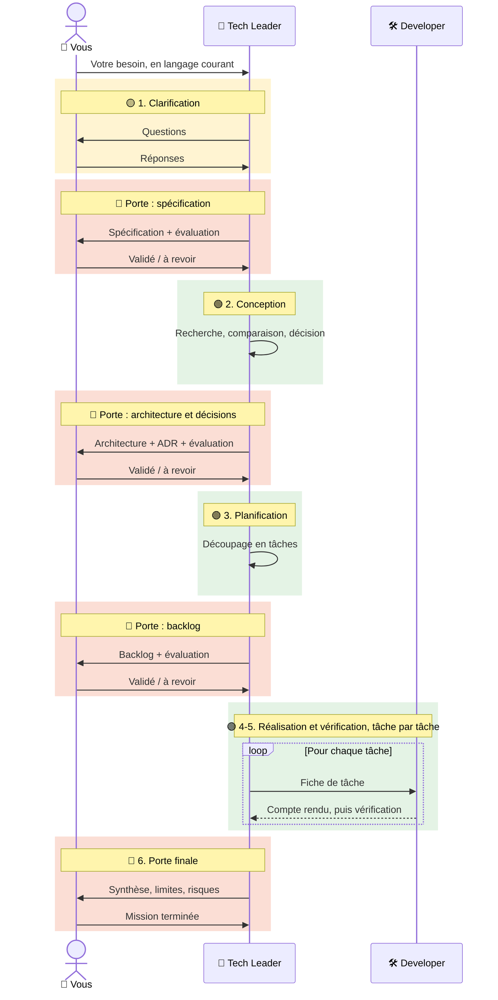

# Qui fait quoi, et quand

Une **mission**, c'est un besoin que vous confiez au Tech Leader : « je voudrais un script qui… »,
« il faudrait que l'outil sache aussi… ». Pendant une mission, l'équipe alterne entre des moments où
elle **travaille seule** et des moments où elle **vous attend**. Toute cette page sert à les
distinguer.

| Code | Signification | Ce que vous faites |
|---|---|---|
| 🟢 | **L'équipe travaille seule** | Rien. Vous pouvez faire autre chose. |
| 🟡 | **L'équipe vous pose une question** | Vous répondez. Rien n'avance tant que vous n'avez pas répondu. |
| 🔴 | **Porte de validation** : l'équipe vous demande une décision | Vous lisez, puis vous validez ou refusez. C'est ce qui engage la suite. |

## Le déroulé d'une mission

Le diagramme montre le déroulé **complet**, celui des niveaux `interne` et `release`. Aux niveaux
inférieurs, les portes se regroupent (voir [plus bas](#combien-de-portes-selon-le-niveau)).

## Phase par phase

| Phase | Ce que l'équipe fait seule | Ce que vous faites | |
|---|---|---|---|
| **1. Clarification** | Elle lit le document projet et la documentation de référence, reformule votre besoin, repère les contradictions et les non-dits. | Vous répondez à ses questions. | 🟡 |
| **Porte : spécification** | Elle présente la spécification et ses critères d'acceptation. | Vous validez ou refusez. | 🔴 |
| **2. Conception** | Elle cherche les solutions possibles, lit leur documentation, les classe de la plus efficace à la plus incertaine, engage la première et garde les autres en réserve, puis rédige l'architecture et les ADR. | Rien : le choix technique est son affaire, elle ne vous demande pas de restreindre les pistes. | 🟢 |
| **Porte : conception** | Elle présente ses choix et leurs conséquences. | Vous vérifiez que la conception sert votre besoin, et vous validez ou refusez. | 🔴 |
| **3. Planification** | Elle découpe le travail en tâches et rédige une [fiche](../comprendre/coulisses-fiche-de-tache.md) pour chacune. | Rien. | 🟢 |
| **Porte : backlog** | Elle présente la liste ordonnée des tâches. | Vous validez ou refusez. | 🔴 |
| **4-5. Réalisation et vérification** | Le Tech Leader délègue les tâches au Developer, une à la fois, et fait vérifier chaque résultat ([détail de la délégation](../comprendre/equipe.md#comment-se-passe-une-delegation)). | Rien, sauf une **demande de permission** ou une **remontée**. | 🟢 |
| **6. Clôture** | Elle présente la synthèse : ce qui est fait, les limites, les risques. | Vous essayez le résultat, puis déclarez la mission terminée. | 🔴 |

Ce que vous vérifiez à chaque porte, et comment réagir à une permission ou à une remontée :
[Vos moments d'attention](attention.md).

## Combien de portes selon le niveau

Le [niveau de qualité](../comprendre/niveaux.md) déclaré dans le document projet fixe le nombre de
portes 🔴 avant la réalisation :

| Niveau | Portes | Ce que vous validez |
|---|---|---|
| `poc`, `script-ponctuel` | 1 | Le besoin et l'approche, en quelques lignes |
| `outil-perso` | 2 | La spécification, puis la conception et le backlog ensemble |
| `interne`, `release` | 3 | Spécification, conception, backlog : le diagramme complet ci-dessus |

La porte finale existe à tous les niveaux. Pour alléger une demande ponctuelle dans un projet
exigeant, dites-le explicitement :

> « C'est une petite modification : tu peux regrouper spécification, conception et planification
> en une seule validation. »

Tous les documents produits sont rangés aux emplacements prévus par la rubrique « Emplacement des
livrables » du [document projet](../demarrer/initialiser-un-projet.md).

??? abstract "Source"
    Sections « Déroulé d'une mission, avec portes de validation » et « Proportionner au niveau de
    qualité » de `C-Users-votre-nom-.claude/agents/tech-leader.md` ; section « Niveau de qualité » des règles d'ingénierie.
