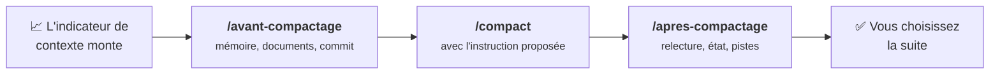

# Piloter une session

Cette page rassemble les commandes et les boutons de l'extension qui vous servent à garder la main
sur une conversation.

## Reprendre la main

| Situation | Que faire |
|---|---|
| L'équipe part dans une mauvaise direction | Bouton **Stop** (à la place du bouton d'envoi) ou **`Échap`**. Le travail déjà fait est conservé, et vous pouvez la réorienter. |
| Vous voulez revenir à un état antérieur | Survolez un message, puis cliquez sur le bouton de **retour en arrière** : vous pouvez rétablir les fichiers tels qu'ils étaient à ce moment-là, repartir de ce message dans une nouvelle branche de conversation, ou les deux. |
| Vous voulez changer de mode de permission | Cliquez sur l'**indicateur de mode**, en bas de la zone de saisie. |
| Vous voulez voir ce que font les sous-agents | Cliquez sur le compteur d'agents (**1 agent**…), en bas de la zone de saisie. |

## Gérer une longue session

| Où | Utilité |
|---|---|
| **Indicateur de contexte** (zone de saisie) | Voir quelle part du contexte est utilisée. |
| `/compact` | Résumer la conversation pour libérer de la place. Vous pouvez préciser sur quoi insister : `/compact garde les décisions de conception`. |
| **Historique des sessions** (en haut du panneau) | Reprendre une conversation précédente. |
| **Nom du modèle** (zone de saisie) | Changer de modèle ou de niveau d'effort. |
| `/usage` | Voir la consommation et les limites de votre abonnement. |
| `/` | Ouvrir le menu des commandes disponibles. |

## Avant et après un compactage

Quand le contexte se remplit, la conversation est **compactée** : elle est résumée, et une partie
des détails se perd. Le document projet et l'index de la mémoire sont rechargés automatiquement,
mais pas le reste. Le kit fournit deux commandes pour encadrer ce moment.



| Commande | Ce que fait Claude |
|---|---|
| `/avant-compactage` | Il range à sa place tout ce qui n'existe que dans la conversation : le suivi du projet dans les documents que désigne le `CLAUDE.md` du projet (dans un projet du kit, les livrables), vos préférences dans sa mémoire. Il **propose** les règles durables pour le `CLAUDE.md` sans les écrire. Il commite (sans pousser), puis vous donne une instruction `/compact` prête à copier. |
| `/apres-compactage` | Il relit sa mémoire, le `CLAUDE.md` du projet, les documents qu'il désigne et l'état du dépôt Git. Il présente son rôle, l'objectif et l'avancement, puis propose une à trois pistes et **attend votre choix**. |

Ces commandes sont installées dans votre configuration personnelle : elles fonctionnent dans
**tous** vos projets, avec ou sans le Tech Leader.

!!! note "Compactage automatique"
    Claude Code compacte aussi de lui-même quand le contexte est plein. Surveillez l'indicateur de
    contexte pour lancer `/avant-compactage` avant. Si le compactage automatique vous a pris de
    vitesse, lancez quand même `/apres-compactage`.

!!! tip "Une mission, une conversation"
    Les livrables sont **écrits dans des fichiers**. Vous pouvez donc ouvrir une nouvelle
    conversation sans rien perdre : lancez `/apres-compactage` pour que le Tech Leader reprenne le
    fil.

## Après une coupure de crédit

Quand les limites de votre abonnement sont atteintes, la conversation s'arrête, parfois au milieu
d'une étape. `/usage` vous indique quand elles se réinitialisent. Une fois le crédit revenu, tapez
dans la même conversation :

```text
/reprendre-apres-coupure
```

Claude ne repart pas à l'aveugle. Il **constate** d'abord l'état réel de la dernière étape : fichier
à moitié écrit, traitement terminé ou non, résultat d'un sous-agent perdu. Il ne refait pas une
action risquée à répéter, comme un commit ou un ajout de données, sans vérifier qu'elle n'a pas déjà
eu lieu. Il vous dit en deux ou trois lignes où il reprend, puis il reprend. Si l'état est
indéterminable, il vous pose la question.

??? abstract "Sources"
    - Extension VS Code (Stop, retour en arrière, indicateurs, historique) :
      [code.claude.com/docs/en/vs-code](https://code.claude.com/docs/en/vs-code)
    - Commandes : [code.claude.com/docs/en/commands](https://code.claude.com/docs/en/commands)
    - Commandes personnalisées : [code.claude.com/docs/en/skills](https://code.claude.com/docs/en/skills)
    - Ce qui survit au compactage, compactage automatique :
      [code.claude.com/docs/en/context-window](https://code.claude.com/docs/en/context-window)
    - Interruption par `Échap` :
      [code.claude.com/docs/en/interactive-mode](https://code.claude.com/docs/en/interactive-mode)
